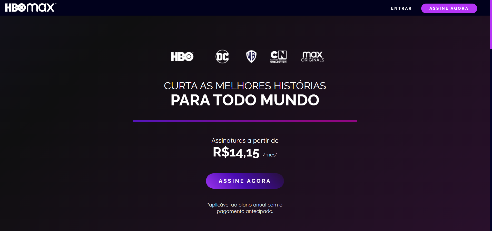

# 🎬 HBO Max Clone 

Clone da página inicial da **HBO Max**, desenvolvido utilizando **HTML5** e **CSS3**, com foco em reproduzir um layout moderno, visual atrativo e responsivo.

Este projeto tem caráter educacional e foi criado para aprimorar habilidades em desenvolvimento front-end.

---

## 🖥️ Preview

🔗 **Acesse o site publicado:**  
👉 https://develyshow.github.io/Clone-HBO-MAX/

<p align="center">
  
</p>

---

## 🛠️ Tecnologias utilizadas

- HTML5
- CSS3
- Flexbox
- Layout responsivo
- Design inspirado em site real

---

## 🎯 Objetivos do projeto

- Praticar **HTML semântico**
- Treinar **CSS moderno**
- Trabalhar com layouts complexos
- Reproduzir interfaces usadas no mercado
- Evoluir atenção a detalhes visuais

---

## 📱 Responsividade

O projeto foi desenvolvido para se adaptar a diferentes dispositivos:

- Desktop
- Tablets
- Smartphones

---

## 📂 Estrutura do projeto

```bash
📁 hbo-max-clone
├── index.html
├── style.css
└── assets/
    └── images/
